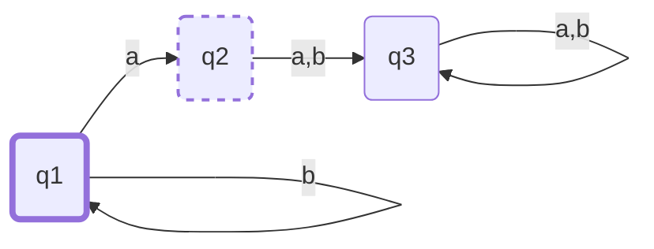
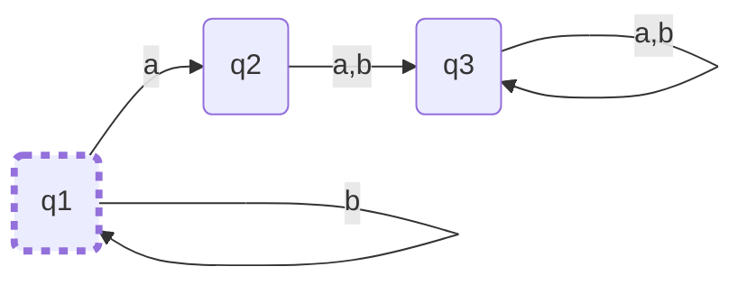
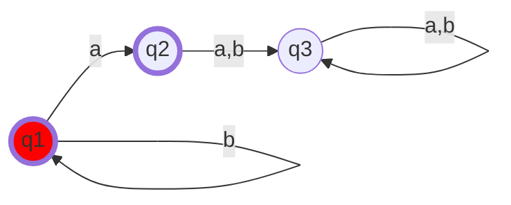
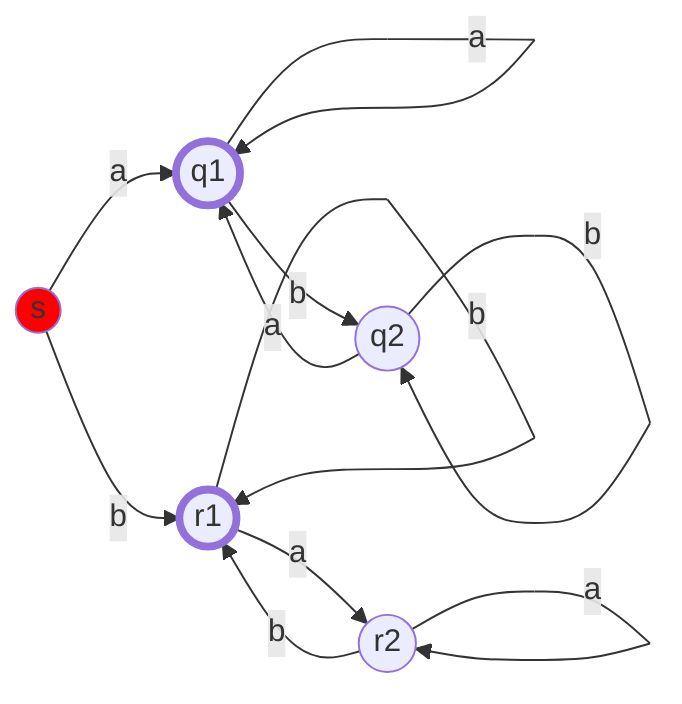
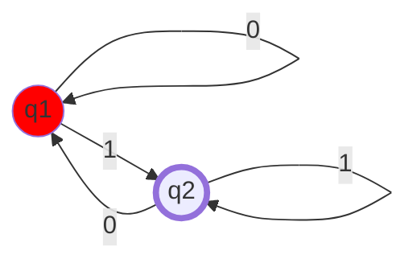
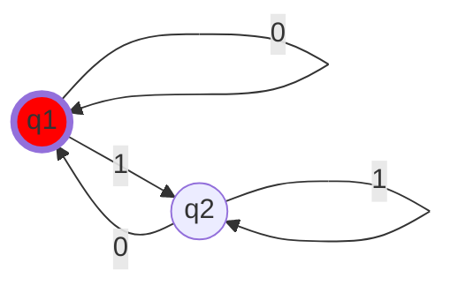
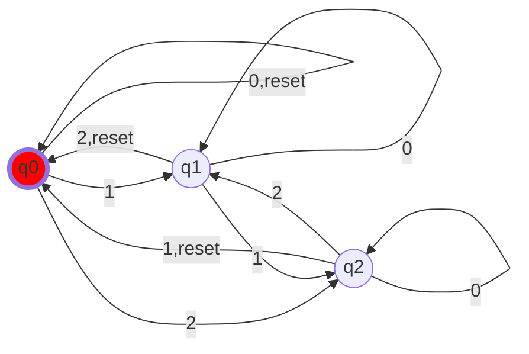

# Exercise Session 2
## Exercise 1
Let $L_1 = \{aa,bb,bbb\}, L_2=\{abba,aab,bb\}$. Specify the following languages:

1. $L_1 \circ L_2$

    ```
    λ>cartesianProduct l1 l2
    fromList [("aa","aab"),("aa","abba"),("aa","bb"),("bb","aab"),("bb","abba"),("bb","bb"),("bbb","aab"),("bbb","abba"),("bbb","bb")]
    ```
2. $L_1 \cup L_2$

    ```
    λ>union l1 l2
    fromList ["aa","aab","abba","bb","bbb"]
    ```
3. $L_1 \cap L_2$

    ```
    λ>intersection l1 l2
    fromList ["bb"]
    ```

4. $L_1 \setminus L_2$

    ```
    λ>l1 \\ l2
    fromList ["aa","bbb"]
    ```

5. Provide a few strings of $L_2^*$

    $A^* = \{\epsilon, abba, aab, bb, abbaabba, aabaab, bbbb, abbaaab, abbabb, aabbb\}$

## Exercise 2
Describe the following automata

### M1


### M2



### M3


- Describe the sequence of states of $M_1$ for the following inputs:
    - abbbab: q1-q2-q3-q3-q3-q3-q3
    - ababaab: q1-q2-q3 (stays in q3)
    - aaaaa: q1-q2-q2 (stays in q3)
    - $\epsilon$: q1
- Which of the previous sequences are final in $M_1$, $M_2$ and $M_3$? (i'll assume this means accepted) which for all of them is only $\epsilon$.
- Describe the languages accapted by each of the three machines. $M_1$ accepts any number of b's followed by a single a. $M_2$ accepts any number of b's. $M_3$ accepts any number of b's with an optional a at the end.

## Exercise 3
Give the state diagram for the following automataton and describe the language.

$M_4=(Q,\Sigma,\delta,q_0,F)$ where:

$Q=\{s,q1,q2,r1,r2\}$

$\Sigma=\{a,b\}$

$q_0=s$

$F=\{q1,r1\}$

| $\delta$ | a | b |
| :------: |:-:|:-:|
| s        |q1 |r1 |
| q1       |q1 |q2 |
| q2       |q1 |q2 |
| r1       |r2 |r1 |
| r2       |r2 |r1 |




Do not have time for a formal proof today, but my intuition says that it is the language that accepts any word which which prefix and suffix is the same.

## Exercise 4
Give the state diagram for an automaton that recognizes the following language.

1. $L_1=\{w \in \{1,22\}^* | \text{11 is a prefix of w}\}$

    Should work as an NFT
    ```mermaid
    flowchart LR
        classDef open fill:#f00;
        classDef close stroke-width:4px;
        classDef both fill:#f00,stroke-width:4px;

        q1((q1)):::open
        q2((q2))
        q3((q3)):::close

        q1 --1--> q2
        q2 --1--> q3
        q3 --1,22--> q3
    ```

2. do not know what is meant by this
3. do not know what is meant by this
4. $L_4 = \{w \in \{go,stop\}^* | w=\epsilon \text{ or ends with stop}\}$


    ```mermaid
    flowchart LR
        classDef open fill:#f00;
        classDef close stroke-width:4px;
        classDef both fill:#f00,stroke-width:4px;

        q1((q1)):::both
        q2((q2))

        q1 --stop--> q1
        q2 --stop--> q1
        q1 --go--> q2
        q2 --go--> q2
    ```

5. $L_5=\{w \in \{0,1\}^* | \text{w has 001 as a prefix or 11 as a suffix}\}$


    ```mermaid
    flowchart LR
        classDef open fill:#f00;
        classDef close stroke-width:4px;
        classDef both fill:#f00,stroke-width:4px;

        s((s)):::open

        r1((r1))
        r2((r2))
        r3((r3))
        r4((r4)):::close

        q1((q1))
        q2((q2))
        q3((q3)):::close

        s --epsln--> r1
        s --epsln--> q1

        r1 --0--> r2
        r2 --0--> r3
        r3 --1--> r4
        r4 --1,0--> r4

        q1 --0,1--> q1
        q1 --1--> q2
        q2 --1--> q3

    ```

## Exercise 5
Consider the automata $M_1$ and $M_2$ bellow.

1. Construct an automaton that recognizes the language $L(M_1) \cap L(M_2)$
2. Prove that the regular languages are closed under intersection.
3. Construct an automaton for each of the following languages:
    1. $\{0,1\}^* \setminus L(M_1)$
    2. $\{0,1\}^* \setminus L(M_2)$
    3. $\{0,1\}^* \setminus L(M_1) \cap L(M_2)$
4. Prove that the set of regular languages is closed under complement.

Hint:

2: Similar construction with the one for union, only that $F = F_1 \times F_2$

4: Change the final states in not-final and reverse.

### M1


### M2


### 5.1
complement of the union of the complements of both of them should do it, but there probably an easier way.

### 5.2
Do not have time

### 5.3
Just switch directions on arrows and then flip final not-final states.

### 5.4
Do not have time

## Exercise 6
Describe the following automaton.



### 6.2

### 6.3
Then we would have a state which keeps track of when we are in the state of $4*n + 3$.
