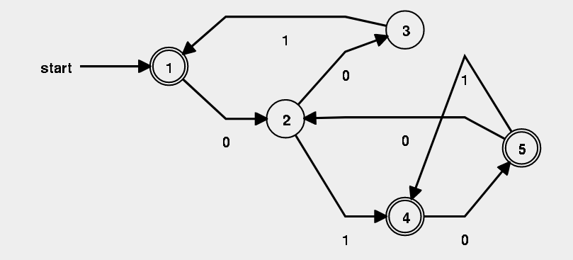

# Exercise Session 5
## Exercise 1
The pumping lemma utilises the pigeon hole principle in the fact that the number p ensures that we at least one cycle. This would also be true for $q \geq p$.

## Exercise 2
## 2.2
We can take the word $w=$0^p10^p$.

In this word $y$ must be at least a single $0$, thus when pump we lose the property that there has to be an equal number of zeros on both sides of the ones.

## 2.3
Regular languages are closed under complement thus we can show that $L=\{0^m1^n|m=n\}$ is not regular.

We can use the word $w=0^p1^p$, this means that $y$ is at least a single $0$ with no $1's$, thus when we pump our equality no longer holds true.

## Exercise 3
It is a equivalence relation if it is transitive, reflexive and symmetric.

Reflexive: $a \equiv_L a$ is vacuously true.

Symmetric: If $a \equiv_L b$ then $b \equiv_L a$ is also correct by the fact that, the statement uses if and only if

Transitive: If $a \equiv_L b$ and $b \equiv_L c$ then $a \equiv_L c$.

## Exercise 4

This one is missing garbage states.

## Exercise 5
b(bb)*(aa)*
